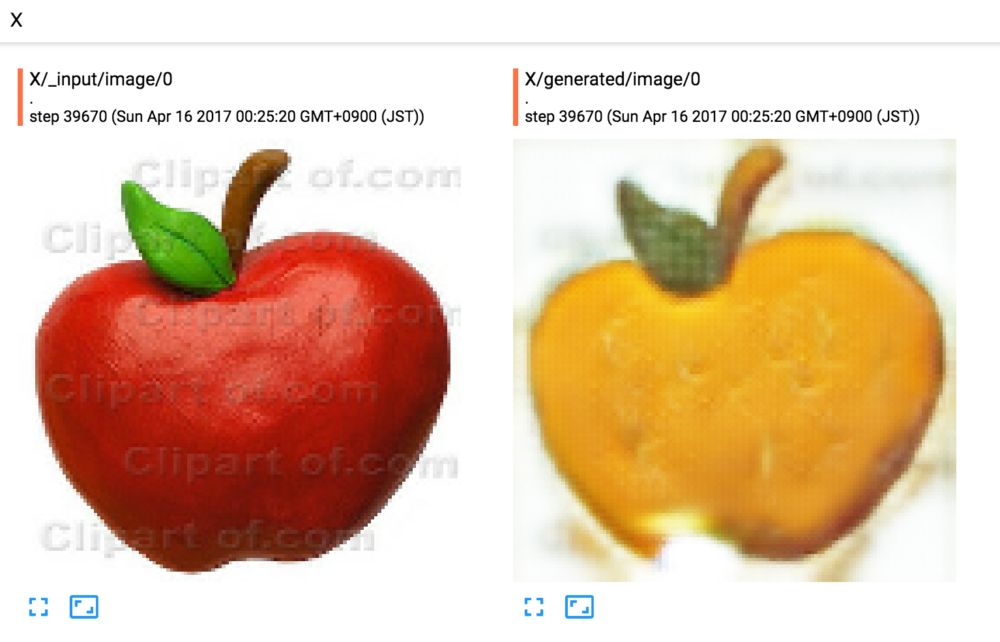
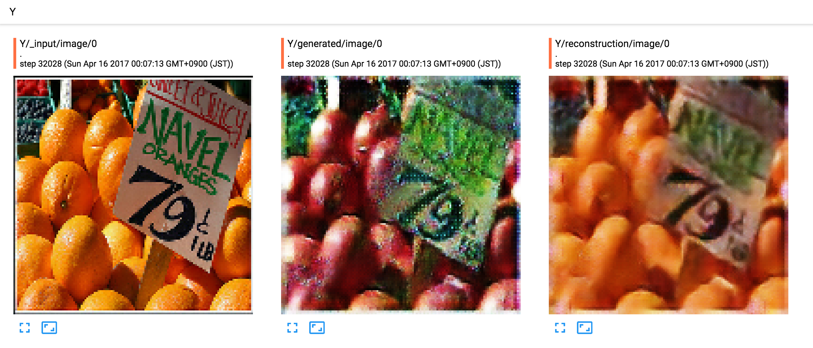
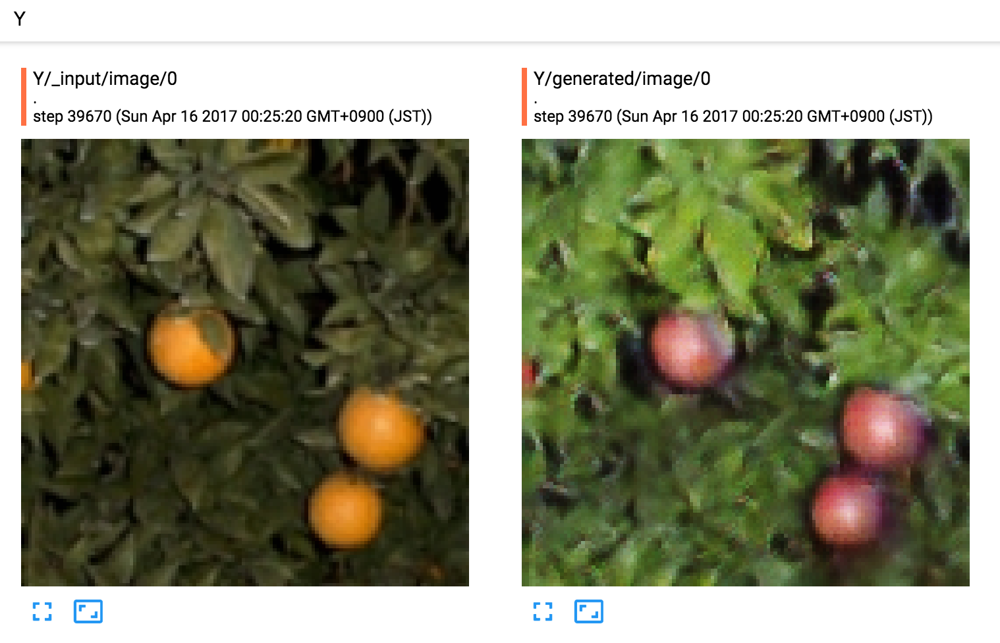

# CycleGAN-TensorFlow
An implementation of CycleGan using TensorFlow (work in progess).

Original paper: https://arxiv.org/abs/1703.10593

## Environment

* TensorFlow 1.0.0
* Python 3.6.0

## Data preparing

* First, download a dataset, e.g. apple2orange

```bash
$ bash download_dataset.sh apple2orange
```

* Write the dataset to tfrecords

```bash
$ python dump.py
```

## Training

```bash
$ python train.py
```

Check TensorBoard to see training progress and generated images.

```
$ tensorboard --logdir checkpoints/${datetime}
```

* apple -> orange

:-------------------------:|:-------------------------:
 | 


* orange -> apple

:-------------------------:|:-------------------------:
 | 

## TODO:

* Instance normalization
* Update discriminators using a history of generated images
